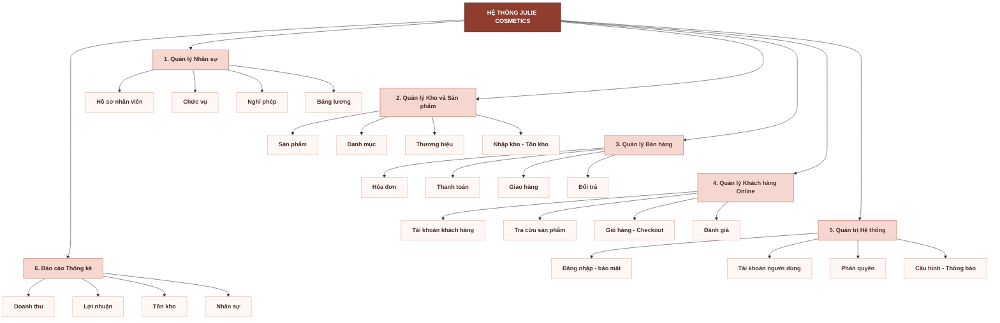
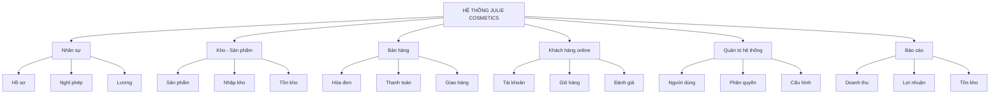

# BFD - Ban rut gon de chen bao cao Word

Ban nay duoc toi uu de:

- de tren 1 trang A4 doc hoac ngang
- de doc trong bao cao
- de export sang PNG hoac SVG roi chen vao `.docx`

## Mermaid - BFD ban doc A4

## Mermaid - BFD ban bao cao ngang

```mermaid
flowchart TB
    A["HỆ THỐNG JULIE COSMETICS"]

    A --> B["1. Quản lý<br/>Nhân sự"]
    A --> C["2. Quản lý<br/>Kho và Sản phẩm"]
    A --> D["3. Quản lý<br/>Bán hàng"]
    A --> E["4. Quản lý<br/>Khách hàng Online"]
    A --> F["5. Quản trị<br/>Hệ thống"]
    A --> G["6. Báo cáo<br/>Thống kê"]

    B --> B1["Hồ sơ<br/>nhân viên"]
    B --> B2["Chức vụ"]
    B --> B3["Nghỉ phép"]
    B --> B4["Bảng lương"]

    C --> C1["Sản phẩm"]
    C --> C2["Danh mục -<br/>Thương hiệu"]
    C --> C3["Nhà cung cấp"]
    C --> C4["Nhập kho -<br/>Tồn kho"]

    D --> D1["Hóa đơn"]
    D --> D2["Thanh toán"]
    D --> D3["Giao hàng"]
    D --> D4["Đổi trả"]

    E --> E1["Tài khoản<br/>khách hàng"]
    E --> E2["Tra cứu - xem<br/>sản phẩm"]
    E --> E3["Giỏ hàng -<br/>Checkout"]
    E --> E4["Đánh giá"]

    F --> F1["Đăng nhập -<br/>bảo mật"]
    F --> F2["Tài khoản<br/>người dùng"]
    F --> F3["Phân quyền"]
    F --> F4["Cấu hình -<br/>Thông báo"]

    G --> G1["Doanh thu"]
    G --> G2["Lợi nhuận"]
    G --> G3["Tồn kho"]
    G --> G4["Nhân sự"]

    classDef root fill:#8f3d2e,color:#fff,stroke:#6d2d22,stroke-width:2px,font-weight:bold;
    classDef lv1 fill:#f6d7cf,color:#4a2a24,stroke:#c98f82,stroke-width:1.5px,font-weight:bold;
    classDef lv2 fill:#fff7f4,color:#4a2a24,stroke:#d8b2a8,stroke-width:1px;

    class A root;
    class B,C,D,E,F,G lv1;
    class B1,B2,B3,B4,C1,C2,C3,C4,D1,D2,D3,D4,E1,E2,E3,E4,F1,F2,F3,F4,G1,G2,G3,G4 lv2;
```

## Ban cuc ngan hon neu can chen nua trang

## Cach chen vao Word

### Neu dung ban doc

1. Chon trang `A4 Portrait`.
2. Dung ban `BFD ban doc A4` o tren.
3. Export `SVG` de hinh net khi phong to trong Word.
4. Chieu rong hinh nen dat khoang `14-16 cm`.
5. Can le giua va de caption ben duoi hinh.

### Neu dung ban ngang

1. Mo `Mermaid Live Editor`.
2. Dan ma ben tren vao.
3. Export `SVG` neu muon net nhat khi chen vao Word.
4. Trong Word, nen de trang `Landscape`.
5. Chieu rong hinh nen dat khoang `24-26 cm` de vua trang A4 ngang.

## Goi y caption de dan vao bao cao

`Hinh X. So do phan ra chuc nang (BFD) cua he thong Julie Cosmetics`
