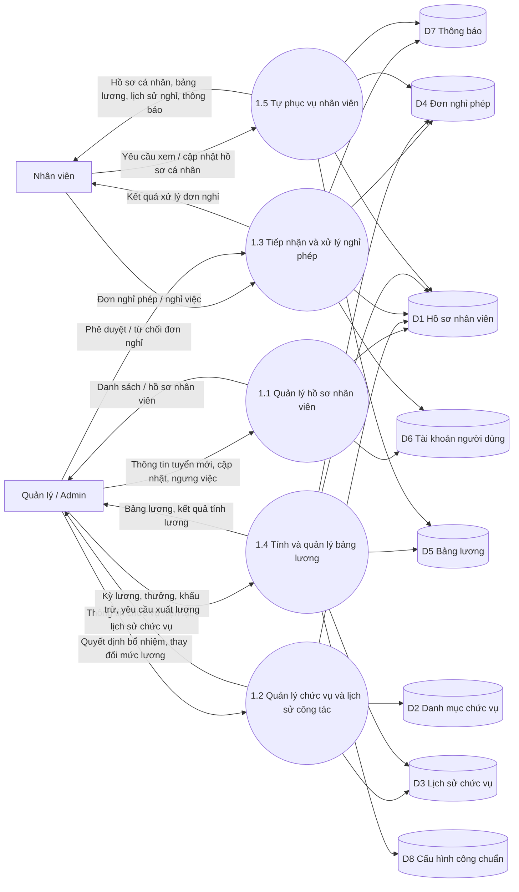
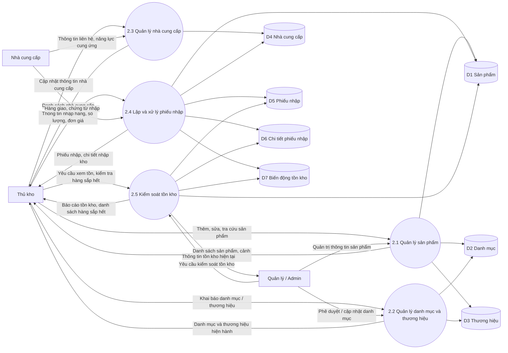
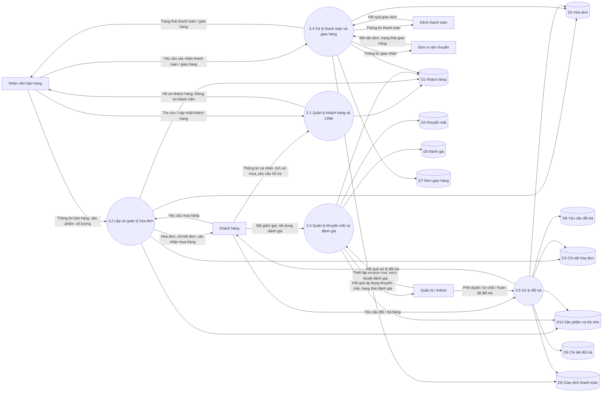

# DFD tien trinh - Nhan su, Kho, Ban hang

Tai lieu nay gom 3 DFD muc duoi dinh, bam theo he thong hien tai cua `Julie Cosmetics`:

1. `1.0 Quan ly Nhan su`
2. `2.0 Quan ly Kho`
3. `3.0 Quan ly Ban hang`

Ghi chu:

- So thu tu duoc danh lai de nhat quan trong bo DFD rieng nay.
- Cac kho du lieu duoc rut gon theo nhom bang chinh, phu hop de dua vao bao cao.
- Ma so do duoi day dung `Mermaid`.

---

## 1. DFD tien trinh 1.0 Quan ly Nhan su

### Kho du lieu su dung

- `D1`: `employees`
- `D2`: `positions`
- `D3`: `employee_positions`
- `D4`: `leave_requests`
- `D5`: `salaries`
- `D6`: `users`
- `D7`: `notifications`
- `D8`: `settings`

---

## 2. DFD tien trinh 2.0 Quan ly Kho

### Kho du lieu su dung

- `D1`: `products`
- `D2`: `categories`
- `D3`: `brands`
- `D4`: `suppliers`
- `D5`: `import_receipts`
- `D6`: `import_receipt_items`
- `D7`: `inventory_movements`

---

## 3. DFD tien trinh 3.0 Quan ly Ban hang

### Kho du lieu su dung

- `D1`: `customers`
- `D2`: `invoices`
- `D3`: `invoice_items`
- `D4`: `promotions`
- `D5`: `reviews`
- `D6`: `payment_transactions`
- `D7`: `shipping_orders`
- `D8`: `returns`
- `D9`: `return_items`
- `D10`: `products`

---

## Goi y chen vao bao cao

- Moi DFD nen de tren mot trang rieng neu muon de doc.
- Neu chen vao Word, nen export `SVG` tu Mermaid de net hon PNG.
- Tieu de hinh co the dung:
  - `Hinh X. DFD tien trinh Quan ly Nhan su`
  - `Hinh Y. DFD tien trinh Quan ly Kho`
  - `Hinh Z. DFD tien trinh Quan ly Ban hang`
