# DFD muc 2 - Julie Cosmetics

Tai lieu nay gom 20 so do DFD muc 2, boc tach tu DFD muc 1 cua cac module: Storefront, Ban hang & CRM, Kho, Nhan su. Moi so do la DFD muc 2 cho mot tien trinh muc 1 tu DFD muc 0.

## 1. Storefront va don hang online (P1)

### 1.1 Dang ky, dang nhap va ho so khach hang

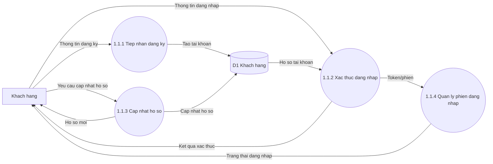

### 1.2 Tra cuu danh muc va danh sach san pham

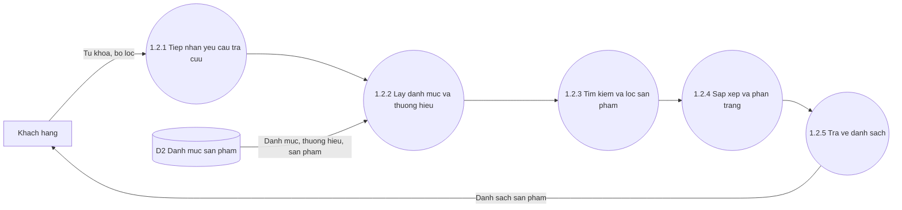

### 1.3 Xem chi tiet san pham va danh gia

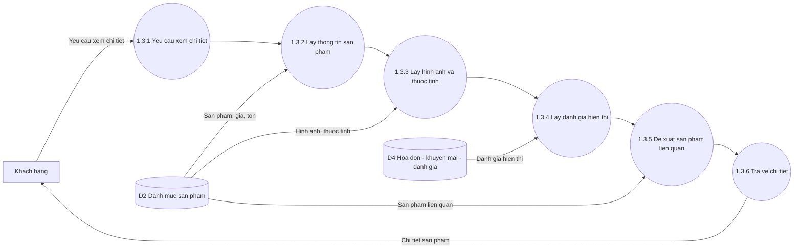

### 1.4 Quan ly gio hang va kiem tra ton

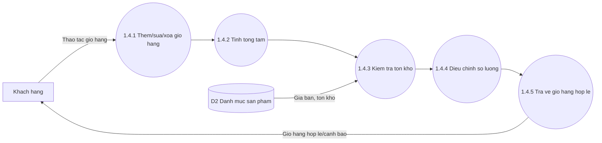

### 1.5 Checkout va tao don hang online

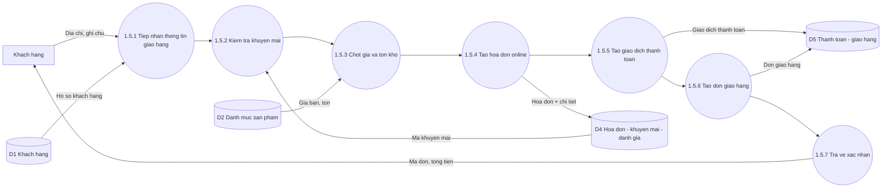

## 2. Quan ly nhan su noi bo (P5)

### 5.1 Quan ly ho so nhan vien

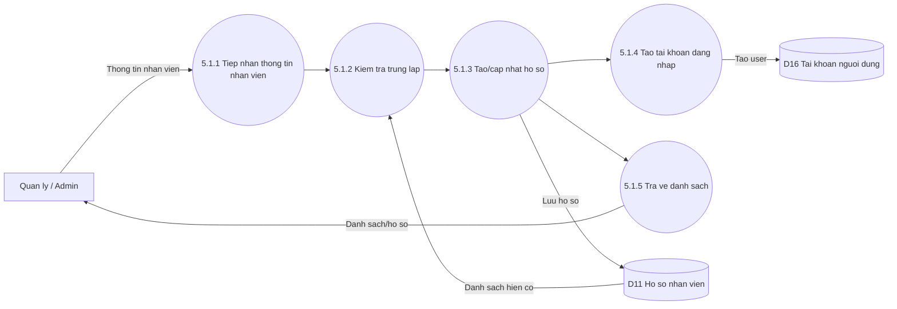

### 5.2 Quan ly chuc vu va lich su cong tac

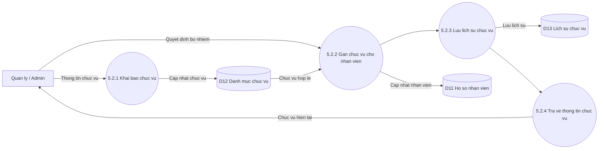

### 5.3 Tiep nhan va xu ly nghi phep

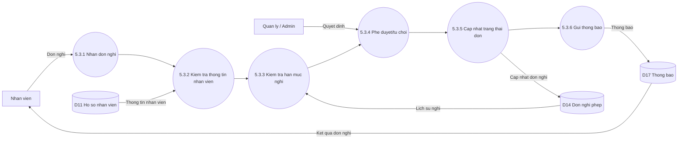

### 5.4 Tinh va quan ly bang luong

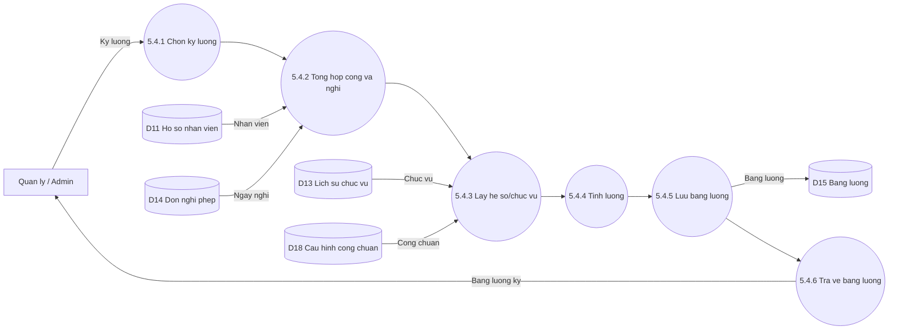

### 5.5 Tu phuc vu nhan vien

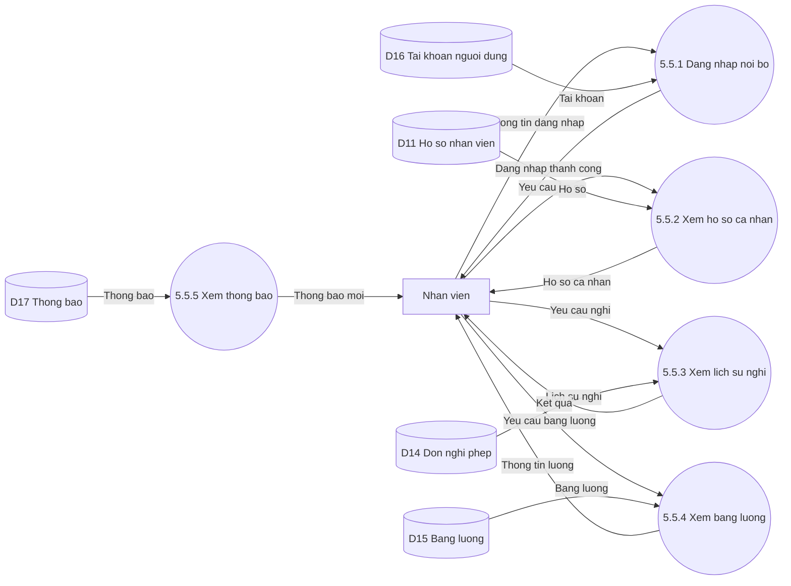

## 3. Quan ly kho va nhap hang (P4)

### 4.1 Quan ly san pham

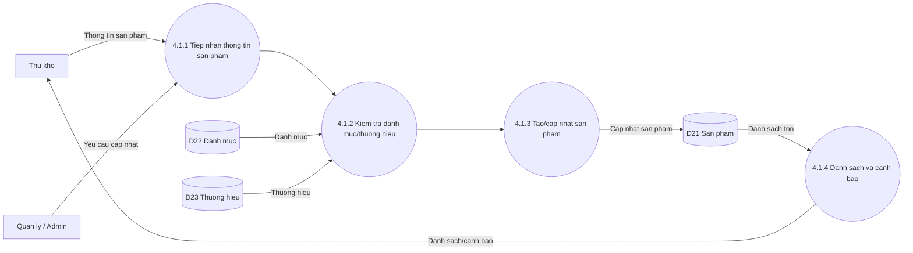

### 4.2 Quan ly danh muc va thuong hieu

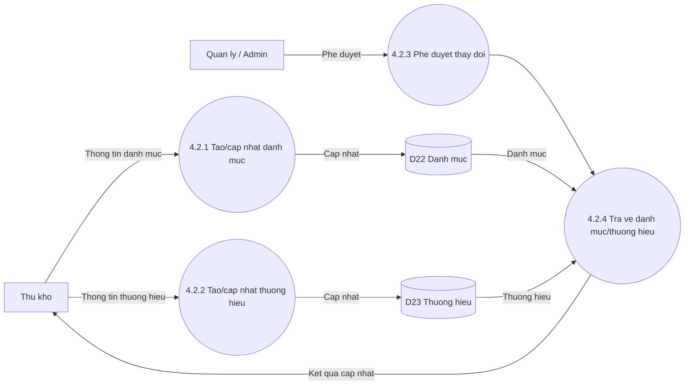

### 4.3 Quan ly nha cung cap

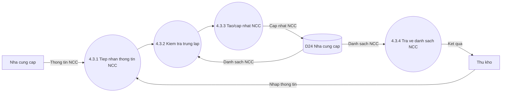

### 4.4 Lap va xu ly phieu nhap

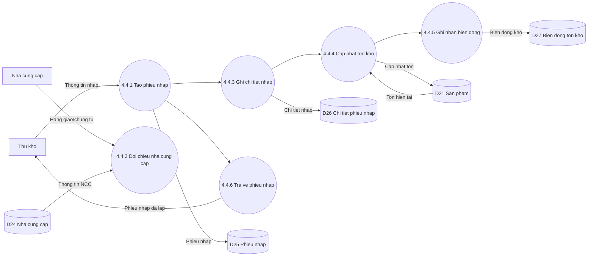

### 4.5 Kiem soat ton kho

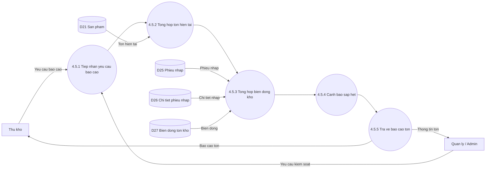

## 4. Ban hang va CRM (P2)

### 2.1 Quan ly khach hang va CRM

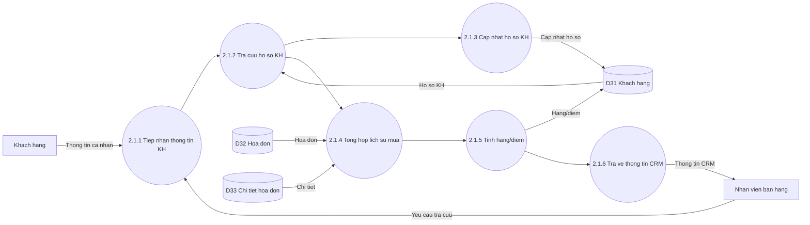

### 2.2 Lap va quan ly hoa don

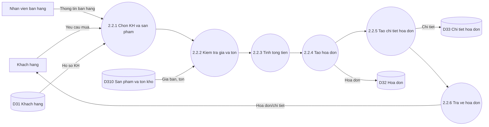

### 2.3 Quan ly khuyen mai va danh gia

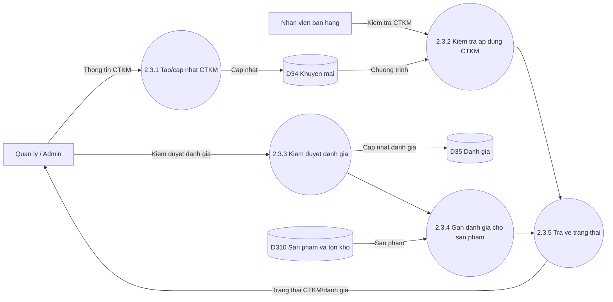

### 2.4 Xu ly thanh toan va giao hang

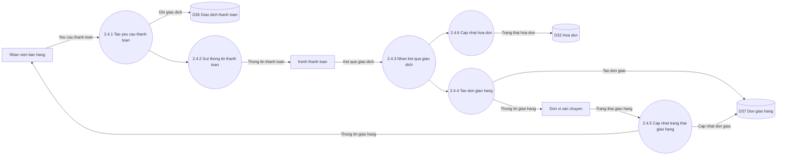

### 2.5 Xu ly doi tra

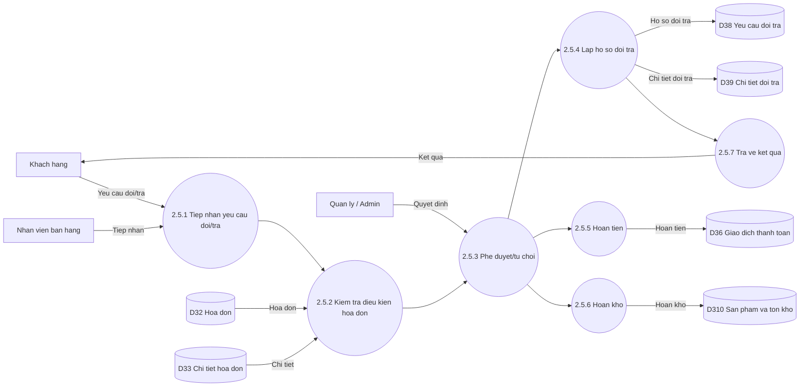
