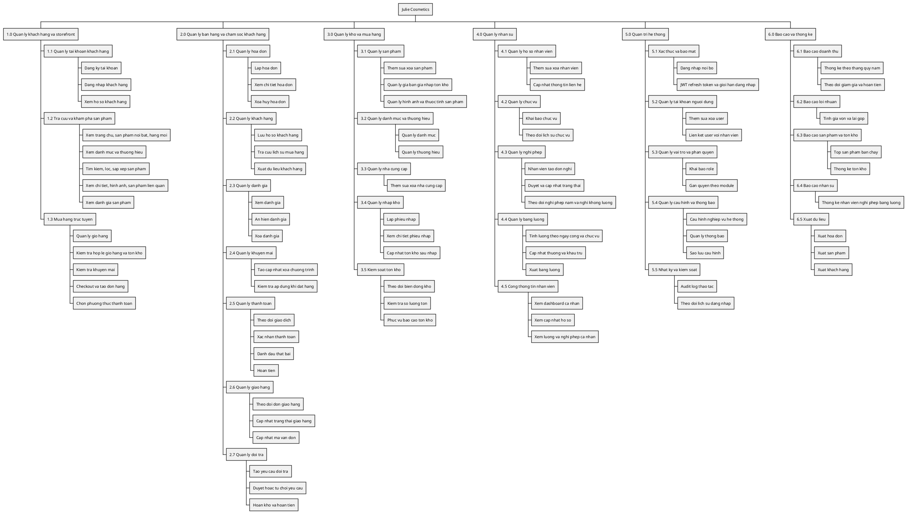

# So do phan ra chuc nang - Julie Cosmetics

Tai lieu nay tong hop so do phan ra chuc nang dua tren:

- `README.md`
- `client/src/App.jsx`
- `server/server.js`
- `server/src/config/moduleRegistry.js`
- `database/schema.sql`

## Mermaid

```mermaid
flowchart TB
    A["0.0 He thong Julie Cosmetics"]

    A --> B["1.0 Quan ly khach hang va storefront"]
    B --> B1["1.1 Quan ly tai khoan khach hang"]
    B1 --> B11["Dang ky tai khoan"]
    B1 --> B12["Dang nhap khach hang"]
    B1 --> B13["Xem ho so khach hang"]
    B --> B2["1.2 Tra cuu va kham pha san pham"]
    B2 --> B21["Xem trang chu, san pham noi bat, hang moi"]
    B2 --> B22["Xem danh muc va thuong hieu"]
    B2 --> B23["Tim kiem, loc, sap xep san pham"]
    B2 --> B24["Xem chi tiet, hinh anh, san pham lien quan"]
    B2 --> B25["Xem danh gia san pham"]
    B --> B3["1.3 Mua hang truc tuyen"]
    B3 --> B31["Quan ly gio hang"]
    B3 --> B32["Kiem tra hop le gio hang va ton kho"]
    B3 --> B33["Kiem tra khuyen mai"]
    B3 --> B34["Checkout va tao don hang"]
    B3 --> B35["Chon phuong thuc thanh toan"]

    A --> C["2.0 Quan ly ban hang va cham soc khach hang"]
    C --> C1["2.1 Quan ly hoa don"]
    C1 --> C11["Lap hoa don"]
    C1 --> C12["Xem chi tiet hoa don"]
    C1 --> C13["Xoa huy hoa don"]
    C --> C2["2.2 Quan ly khach hang"]
    C2 --> C21["Luu ho so khach hang"]
    C2 --> C22["Tra cuu lich su mua hang"]
    C2 --> C23["Xuat du lieu khach hang"]
    C --> C3["2.3 Quan ly danh gia"]
    C3 --> C31["Xem danh gia"]
    C3 --> C32["An hien danh gia"]
    C3 --> C33["Xoa danh gia"]
    C --> C4["2.4 Quan ly khuyen mai"]
    C4 --> C41["Tao cap nhat xoa chuong trinh"]
    C4 --> C42["Kiem tra ap dung khi dat hang"]
    C --> C5["2.5 Quan ly thanh toan"]
    C5 --> C51["Theo doi giao dich"]
    C5 --> C52["Xac nhan thanh toan"]
    C5 --> C53["Danh dau that bai"]
    C5 --> C54["Hoan tien"]
    C --> C6["2.6 Quan ly giao hang"]
    C6 --> C61["Theo doi don giao hang"]
    C6 --> C62["Cap nhat trang thai giao hang"]
    C6 --> C63["Cap nhat ma van don"]
    C --> C7["2.7 Quan ly doi tra"]
    C7 --> C71["Tao yeu cau doi tra"]
    C7 --> C72["Duyet hoac tu choi yeu cau"]
    C7 --> C73["Hoan kho va hoan tien"]

    A --> D["3.0 Quan ly kho va mua hang"]
    D --> D1["3.1 Quan ly san pham"]
    D1 --> D11["Them sua xoa san pham"]
    D1 --> D12["Quan ly gia ban gia nhap ton kho"]
    D1 --> D13["Quan ly hinh anh va thuoc tinh san pham"]
    D --> D2["3.2 Quan ly danh muc va thuong hieu"]
    D2 --> D21["Quan ly danh muc"]
    D2 --> D22["Quan ly thuong hieu"]
    D --> D3["3.3 Quan ly nha cung cap"]
    D3 --> D31["Them sua xoa nha cung cap"]
    D --> D4["3.4 Quan ly nhap kho"]
    D4 --> D41["Lap phieu nhap"]
    D4 --> D42["Xem chi tiet phieu nhap"]
    D4 --> D43["Cap nhat ton kho sau nhap"]
    D --> D5["3.5 Kiem soat ton kho"]
    D5 --> D51["Theo doi bien dong kho"]
    D5 --> D52["Kiem tra so luong ton"]
    D5 --> D53["Phuc vu bao cao ton kho"]

    A --> E["4.0 Quan ly nhan su"]
    E --> E1["4.1 Quan ly ho so nhan vien"]
    E1 --> E11["Them sua xoa nhan vien"]
    E1 --> E12["Cap nhat thong tin lien he"]
    E --> E2["4.2 Quan ly chuc vu"]
    E2 --> E21["Khai bao chuc vu"]
    E2 --> E22["Theo doi lich su chuc vu"]
    E --> E3["4.3 Quan ly nghi phep"]
    E3 --> E31["Nhan vien tao don nghi"]
    E3 --> E32["Duyet va cap nhat trang thai"]
    E3 --> E33["Theo doi nghi phep nam va nghi khong luong"]
    E --> E4["4.4 Quan ly bang luong"]
    E4 --> E41["Tinh luong theo ngay cong va chuc vu"]
    E4 --> E42["Cap nhat thuong va khau tru"]
    E4 --> E43["Xuat bang luong"]
    E --> E5["4.5 Cong thong tin nhan vien"]
    E5 --> E51["Xem dashboard ca nhan"]
    E5 --> E52["Xem cap nhat ho so"]
    E5 --> E53["Xem luong va nghi phep ca nhan"]

    A --> F["5.0 Quan tri he thong"]
    F --> F1["5.1 Xac thuc va bao mat"]
    F1 --> F11["Dang nhap noi bo"]
    F1 --> F12["JWT refresh token va gioi han dang nhap"]
    F --> F2["5.2 Quan ly tai khoan nguoi dung"]
    F2 --> F21["Them sua xoa user"]
    F2 --> F22["Lien ket user voi nhan vien"]
    F --> F3["5.3 Quan ly vai tro va phan quyen"]
    F3 --> F31["Khai bao role"]
    F3 --> F32["Gan quyen theo module"]
    F --> F4["5.4 Quan ly cau hinh va thong bao"]
    F4 --> F41["Cau hinh nghiep vu he thong"]
    F4 --> F42["Quan ly thong bao"]
    F4 --> F43["Sao luu cau hinh"]
    F --> F5["5.5 Nhat ky va kiem soat"]
    F5 --> F51["Audit log thao tac"]
    F5 --> F52["Theo doi lich su dang nhap"]

    A --> G["6.0 Bao cao va thong ke"]
    G --> G1["6.1 Bao cao doanh thu"]
    G1 --> G11["Thong ke theo thang quy nam"]
    G1 --> G12["Theo doi giam gia va hoan tien"]
    G --> G2["6.2 Bao cao loi nhuan"]
    G2 --> G21["Tinh gia von va lai gop"]
    G --> G3["6.3 Bao cao san pham va ton kho"]
    G3 --> G31["Top san pham ban chay"]
    G3 --> G32["Thong ke ton kho"]
    G --> G4["6.4 Bao cao nhan su"]
    G4 --> G41["Thong ke nhan vien nghi phep bang luong"]
    G --> G5["6.5 Xuat du lieu"]
    G5 --> G51["Xuat hoa don"]
    G5 --> G52["Xuat san pham"]
    G5 --> G53["Xuat khach hang"]
```

## PlantUML

