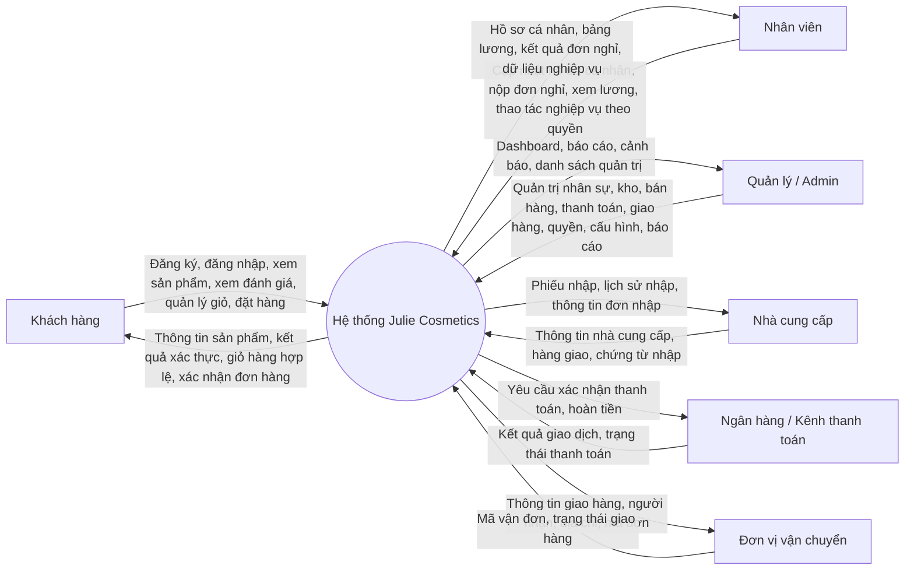
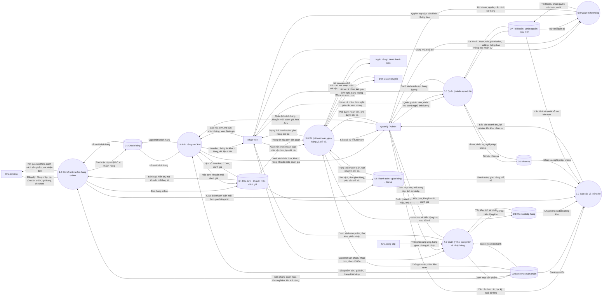
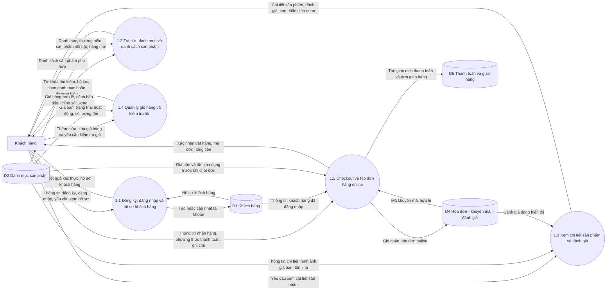

# Phân tích hệ thống và mã sơ đồ DFD - Julie Cosmetics

Tài liệu này chốt lại 3 sơ đồ theo đúng luồng đang có trong code hiện tại của `Julie Cosmetics`:

1. Sơ đồ ngữ cảnh
2. DFD mức đỉnh (Level 0)
3. DFD mức dưới đỉnh (Level 1) cho tiến trình `1.0 Storefront và đơn hàng online`

Mã sơ đồ dùng `Mermaid`, có thể paste trực tiếp vào:

- Mermaid Live Editor
- draw.io / diagrams.net có hỗ trợ Mermaid
- Markdown renderer hỗ trợ Mermaid

## 1. Cơ sở phân tích

Phân tích này bám theo các phần đang chạy thật trong repo:

- Frontend route: [App.jsx](/Users/heisenbon/Documents/Workspace%20Code/HTTTDN/Julie%20Cosmetics/client/src/App.jsx)
- Storefront: [CheckoutPage.jsx](/Users/heisenbon/Documents/Workspace%20Code/HTTTDN/Julie%20Cosmetics/client/src/components/shop/CheckoutPage.jsx), [publicService.js](/Users/heisenbon/Documents/Workspace%20Code/HTTTDN/Julie%20Cosmetics/client/src/services/publicService.js)
- Public API: [publicRoutes.js](/Users/heisenbon/Documents/Workspace%20Code/HTTTDN/Julie%20Cosmetics/server/src/routes/publicRoutes.js)
- Customer auth: [customerAuthRoutes.js](/Users/heisenbon/Documents/Workspace%20Code/HTTTDN/Julie%20Cosmetics/server/src/routes/customerAuthRoutes.js)
- Nội bộ: [server.js](/Users/heisenbon/Documents/Workspace%20Code/HTTTDN/Julie%20Cosmetics/server/server.js), [moduleRegistry.js](/Users/heisenbon/Documents/Workspace%20Code/HTTTDN/Julie%20Cosmetics/server/src/config/moduleRegistry.js)
- Các nghiệp vụ lõi: `invoice`, `payment`, `shipping`, `return`, `import`, `leave`, `salary`, `report`
- CSDL: [schema.sql](/Users/heisenbon/Documents/Workspace%20Code/HTTTDN/Julie%20Cosmetics/database/schema.sql)

## 2. Các điểm cần chốt để vẽ đúng

- Storefront hiện có các luồng: đăng ký khách hàng, đăng nhập khách hàng, xem sản phẩm, xem đánh giá hiển thị, giỏ hàng, checkout.
- Frontend hiện yêu cầu khách hàng đăng nhập trước khi checkout ở [CheckoutPage.jsx](/Users/heisenbon/Documents/Workspace%20Code/HTTTDN/Julie%20Cosmetics/client/src/components/shop/CheckoutPage.jsx), dù backend có route public `/api/public/checkout`.
- Khách hàng hiện chỉ xem đánh giá trên storefront. Repo chưa có luồng gửi đánh giá từ giao diện khách hàng.
- Khi checkout, hệ thống tạo:
  - `invoice` và `invoice_items`
  - `payment_transaction`
  - `shipping_order` nếu có địa chỉ giao hàng
- Thanh toán, giao hàng, đổi trả hiện là module nội bộ cập nhật trạng thái; khi vẽ DFD có thể giữ `Kênh thanh toán` và `Đơn vị vận chuyển` như tác nhân ngoài ở mức nghiệp vụ.
- Đổi trả hiện đi qua route nội bộ có `protect`, không phải public flow của khách hàng.

## 3. Tác nhân ngoài và kho dữ liệu

### Tác nhân ngoài

- `Khách hàng`
- `Nhân viên`
- `Quản lý / Admin`
- `Nhà cung cấp`
- `Ngân hàng / Kênh thanh toán`
- `Đơn vị vận chuyển`

### Nhóm kho dữ liệu dùng trong DFD

- `D1 Khách hàng`: `customers`
- `D2 Danh mục sản phẩm`: `products`, `brands`, `categories`, `product_images`, `skin_types`, `product_skin_types`
- `D3 Kho và nhập hàng`: `suppliers`, `import_receipts`, `import_receipt_items`, `inventory_movements`
- `D4 Hóa đơn - khuyến mãi - đánh giá`: `invoices`, `invoice_items`, `promotions`, `reviews`
- `D5 Thanh toán - giao hàng - đổi trả`: `payment_transactions`, `customer_addresses`, `shipping_orders`, `returns`, `return_items`
- `D6 Nhân sự`: `employees`, `positions`, `employee_positions`, `leave_requests`, `salaries`
- `D7 Tài khoản - phân quyền - cấu hình - thông báo`: `users`, `roles`, `permissions`, `role_permissions`, `settings`, `notifications`, `refresh_tokens`, `login_attempts`, `audit_logs`

## 4. Sơ đồ ngữ cảnh

## 5. DFD mức đỉnh - Level 0

## 6. DFD mức dưới đỉnh - Level 1 cho tiến trình 1.0

Lý do chọn phân rã `1.0 Storefront và đơn hàng online`:

- Đây là luồng xuyên suốt nhất từ phía khách hàng
- Bám rất sát code hiện tại ở `publicRoutes`, `CheckoutPage`, `customerAuthRoutes`
- Dễ bảo vệ khi trình bày vì có thể đối chiếu thẳng với route và bảng dữ liệu

## 7. Gợi ý khi đem đi vẽ

- Nếu dùng Mermaid Live Editor: paste nguyên block code vào, sau đó export `SVG`.
- Nếu dùng draw.io: vào `Insert` -> `Advanced` -> `Mermaid`.
- Khi chèn báo cáo Word:
  - Sơ đồ ngữ cảnh nên để 1 trang riêng
  - DFD Level 0 nên để trang ngang nếu cần
  - DFD Level 1 có thể để trang dọc nếu phóng rộng vừa đủ

## 8. Ghi chú để thuyết trình

- `1.0` được chọn làm tiến trình phân rã Level 1 vì gắn trực tiếp với luồng khách hàng của hệ thống hiện tại.
- Nếu giảng viên yêu cầu Level 1 cho tiến trình khác như `Nhân sự`, `Kho` hoặc `Bán hàng`, bạn có thể tách tiếp từ các module đã có trong repo.
- Bộ sơ đồ này đã chỉnh lại 3 điểm dễ bị vẽ sai:
  - Không vẽ khách hàng có luồng gửi đánh giá ở phiên bản hiện tại
  - Không vẽ đổi trả là public flow của khách hàng
  - Thể hiện checkout tạo đồng thời hóa đơn, giao dịch thanh toán và đơn giao hàng
